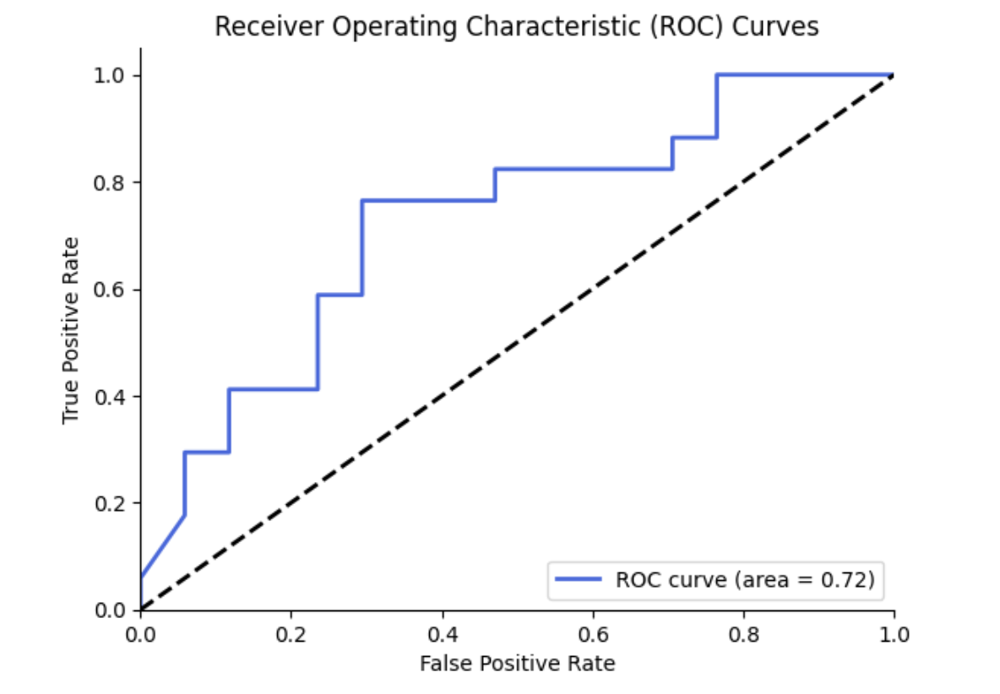
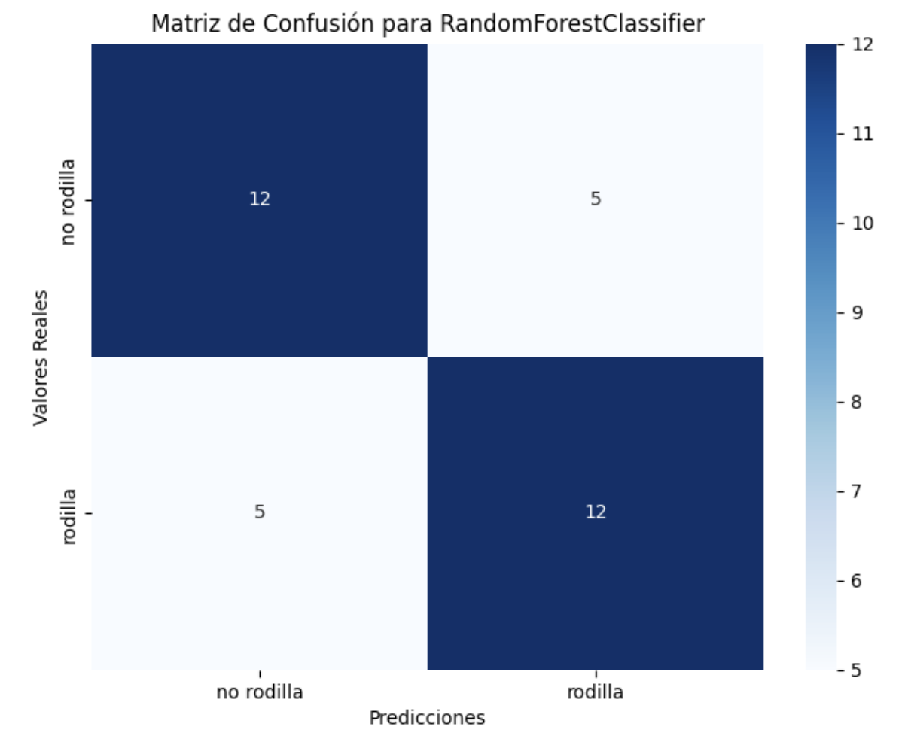
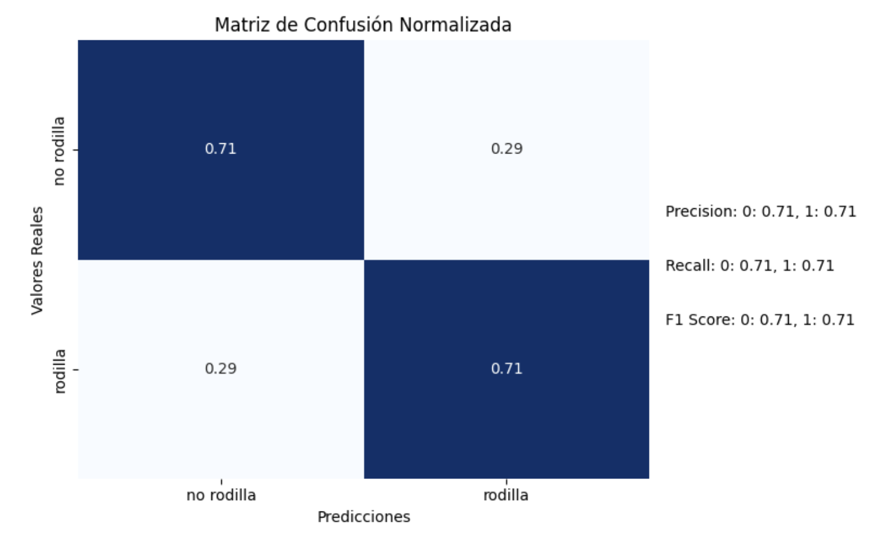

# Clasificador de Lesiones de Rodilla

## Descripción del Proyecto

Este proyecto se centra en el desarrollo de un modelo predictivo para clasificar el riesgo de lesión de rodilla basado en datos biomecánicos. Después de evaluar múltiples modelos de clasificación, se seleccionó el clasificador Random Forest como el modelo más robusto y efectivo. El conjunto de datos, procesado a partir de diversas características biomecánicas, se utiliza para predecir si un individuo está en riesgo de sufrir una lesión de rodilla.

## Modelos Evaluados

Durante este proyecto se evaluaron varios modelos, incluyendo:

- **Random Forest** (Modelo Seleccionado)
- Bagging Classifier
- Decision Tree
- Gradient Boosting Classifier
- Voting Classifier

El modelo Random Forest fue elegido por su rendimiento, particularmente después de su optimización utilizando GridSearchCV con validación cruzada de 10 pliegues.

## Resultados Clave

- **Mejor puntuación promedio de validación cruzada**: 0.669
- **Mejores Parámetros**:
  - `max_depth`: 6
  - `max_features`: 'log2'
  - `min_samples_leaf`: 1
  - `min_samples_split`: 2
- **Precisión en el entrenamiento**: 0.9779
- **Precisión en la prueba**: 0.7353
- **AUC-ROC**: 0.7612

### Métricas Detalladas:

- **Precisión**:
  - Sin Lesión de Rodilla: 0.75
  - Lesión de Rodilla: 0.72
- **Exhaustividad (Recall)**:
  - Sin Lesión de Rodilla: 0.71
  - Lesión de Rodilla: 0.76
- **Puntuación F1**:
  - Sin Lesión de Rodilla: 0.73
  - Lesión de Rodilla: 0.74

### Matriz de Confusión:

- Predicciones correctas para sin lesión de rodilla: 12
- Predicciones incorrectas para sin lesión de rodilla: 5
- Predicciones correctas para lesión de rodilla: 12
- Predicciones incorrectas para lesión de rodilla: 5

### Conclusión

Después de un exhaustivo análisis y comparación, el modelo Random Forest demostró un rendimiento equilibrado entre precisión y capacidad de generalización, lo que lo convierte en la opción óptima para predecir el riesgo de lesión de rodilla.

## Características Utilizadas

El modelo fue entrenado con las siguientes características:

- **Datos Biomecánicos**:
  - IMC
  - Tasa de Fuerza Total
  - Tasa de Paso
  - Excursión de Pronación (mp -> to)
  - Impacto GS
  - Ratio de Contacto
  - Velocidad Máxima de Pronación
  - Potencia
  - Excursión de Apoyo (fs -> mp)
  - Rigidez Vertical del Resorte
  - Fuerza de Frenado GS
  - Peso
  - Excursión de Pronación
  - Tipo de Golpe de Pie
  - Excursión de Apoyo (mp -> to)
  - Ritmo
  - Longitud de Paso
  - Altura
  - Tasa de GRF Vertical
  - Edad
  - Ángulo de Zancada
  - Tamaño de Zapato
  - Impacto
  - Velocidad
  - Torsión Femoral Externa (TFE)
  - FPI Total (Postura Dorsal del Pie)
  - Hallux Limitus (HL)
  - Prueba de Thomas para TFL
  - Genu Recurvatum
  - Prueba de Jack (No Reconstruido)

## Nota sobre los Archivos de Datos

Los archivos de la carpeta `data`, que incluyen el conjunto de datos `dataset_run.csv` y otros archivos relacionados, no han sido subidos a este repositorio debido a que contienen información propietaria del equipo de investigación de la Universidad San Jorge de Zaragoza (España). Estos datos son confidenciales y pertenecen a un proyecto de investigación en curso, por lo que no pueden ser compartidos públicamente.

Si tienes interés en acceder a los datos o en colaborar con el equipo de investigación, te recomendamos ponerte en contacto directamente con la [Universidad San Jorge](https://www.usj.es/) para más información.
