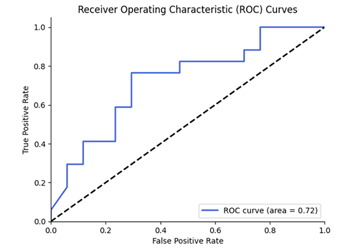
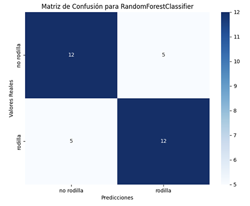
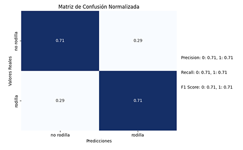

# Clasificador de Lesiones de Rodilla

## Descripción del Proyecto

Este proyecto representa la **segunda fase** de un sistema predictivo aplicado al ámbito clínico-deportivo, centrado en el desarrollo de un modelo de machine learning para **predecir el riesgo de lesión de rodilla** a partir de datos biomecánicos.

Tras evaluar múltiples algoritmos, el modelo **Random Forest** fue seleccionado por su robustez, interpretabilidad y rendimiento general, optimizado mediante **GridSearchCV** con validación cruzada.

Este trabajo surge como evolución de la investigación inicial presentada en el **11º Congreso Conjunto AEA-SEROD** (Barcelona) _([ver certificado](/src/pdf/240626-aea-serod2024-certificado-ponente-medico.pdf))_, donde se abordó el riesgo global de lesiones musculoesqueléticas. En esta fase, el foco se centra exclusivamente en lesiones de rodilla, destacando la **aplicación práctica de la inteligencia artificial en biomecánica**.

## Contexto del Proyecto

- **Fase 1:** Diseño y despliegue de un sistema predictivo para lesiones musculoesqueléticas generales ([ver repositorio](https://github.com/rociobenitez/BiomechanicalRiskPrediction)), incluyendo el uso de Google Cloud Platform.
- **Fase 2:** Enfoque específico en la predicción de lesiones de rodilla mediante algoritmos de clasificación supervisada.

Este proyecto ha sido **reconocido a nivel científico**, y ha contado con colaboración de equipos médicos y de investigación especializados.

## Modelos Evaluados

Se evaluaron diferentes algoritmos de clasificación para determinar el más adecuado según criterios de precisión, recall y capacidad de generalización:

- **Random Forest** _(seleccionado)_
- Bagging Classifier
- Decision Tree
- Gradient Boosting Classifier
- Voting Classifier

El modelo final fue optimizado mediante **GridSearchCV**, empleando validación cruzada con 10 pliegues.

## Resultados Clave

- **Puntuación media de validación cruzada**: 0.669
- **Parámetros óptimos**:
  - `max_depth`: 6
  - `max_features`: 'log2'
  - `min_samples_leaf`: 1
  - `min_samples_split`: 2
- **Precisión entrenamiento**: 0.9779
- **Precisión test**: 0.7353
- **AUC-ROC**: 0.7612

### Métricas Detalladas:

| Clase                 | Precisión | Recall | F1-score |
| --------------------- | --------- | ------ | -------- |
| Sin lesión de rodilla | 0.75      | 0.71   | 0.73     |
| Lesión de rodilla     | 0.72      | 0.76   | 0.74     |

### Matriz de Confusión:

### Conclusión

El modelo **Random Forest** ofreció el mejor equilibrio entre precisión y generalización en comparación con otros algoritmos evaluados, siendo especialmente efectivo para contextos clínicos en los que el **riesgo de lesión debe anticiparse con una base cuantificable y replicable**.

## Características Utilizadas

Las variables utilizadas incluyen datos antropométricos, biomecánicos y clínicos. Algunas de las más relevantes:

- **Antropometría**: IMC, altura, peso, edad, talla de calzado
- **Cinemática y dinámica**: step rate, pace, velocidad, step length, stride angle, power, pronation excursion, vertical GRF rate, vertical spring stiffness, contact ratio, impacto GS
- **Tipo de pisada**: footstrike type, braking GS, shock
- **Variables clínicas**: Torsión Femoral Externa, Foot Posture Index (FPI), Hallux Limitus, prueba de Jack, prueba de Thomas, genu recurvatum

## Consideraciones Éticas y Confidenciales

Por razones de confidencialidad y protección de datos, los archivos del conjunto de datos (`dataset_run.csv` y asociados) no están disponibles públicamente. Los datos utilizados pertenecen al equipo de investigación de la **Universidad San Jorge de Zaragoza**, y forman parte de un estudio clínico en curso.

Para más información o interés en colaboración científica, se recomienda contactar directamente con la institución: [www.usj.es](https://www.usj.es/).
